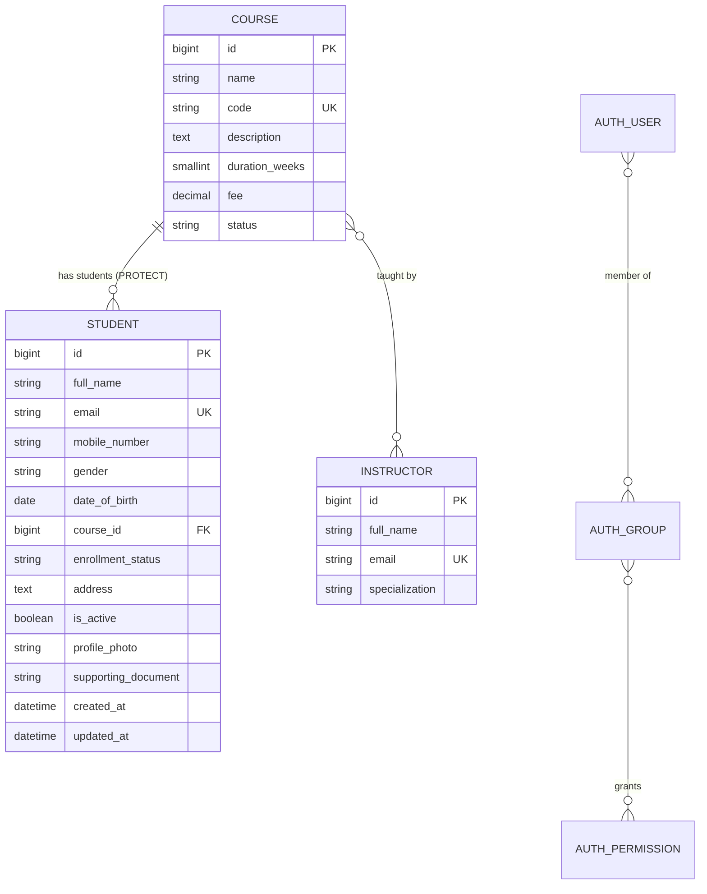

# Database Diagram

```mermaid
erDiagram
    COURSE ||--o{ STUDENT : "has students (PROTECT)"
    COURSE }o--o{ INSTRUCTOR : "taught by"
    AUTH_USER }o--o{ AUTH_GROUP : "member of"
    AUTH_GROUP }o--o{ AUTH_PERMISSION : "grants"
    COURSE {
        bigint id PK
        string name
        string code UK
        text description
        smallint duration_weeks
        decimal fee
        string status
    }
    INSTRUCTOR {
        bigint id PK
        string full_name
        string email UK
        string specialization
    }
    STUDENT {
        bigint id PK
        string full_name
        string email UK
        string mobile_number
        string gender
        date date_of_birth
        bigint course_id FK
        string enrollment_status
        text address
        boolean is_active
        string profile_photo
        string supporting_document
        datetime created_at
        datetime updated_at
    }
```

AUTH_USER, AUTH_GROUP and AUTH_PERMISSION are Django's built-in tables. Roles are groups with permissions.